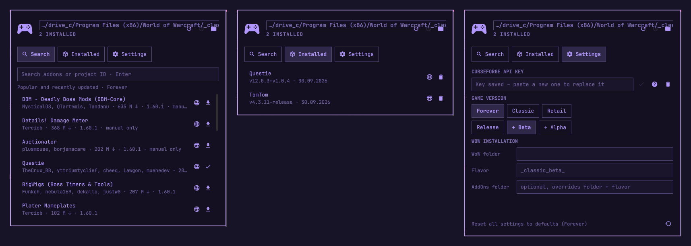

# WoW Addons for Omarchy

A bar widget for [Omarchy](https://omarchy.org) that manages World of Warcraft
addons from [CurseForge](https://www.curseforge.com/wow): search, install,
update and remove them without leaving your desktop. Defaults to
**WoW: Forever**; Classic and Retail work too.



- Bar icon shows how many updates are pending (right-click re-checks)
- Search by name or project ID, one-click install
- Installed tab with version info, per-addon update/remove, "update all"
- Verifies CurseForge checksums and refuses unsafe ZIP paths
- Respects authors who disable third-party downloads: the panel opens the
  CurseForge page and imports the ZIP from `~/Downloads` for you
- Auto-detects WoW installs under Wine/Proton/Lutris/Steam prefixes

## Install

```bash
omarchy plugin add https://github.com/BabaStardust/Omarchy-WoW-Addons-Plugin --enable
```

Then click the gamepad icon in the bar. **The first time, the panel asks for a
free CurseForge API key** — see below.

## Get a CurseForge API key

CurseForge requires every app that talks to its API to use a personal key.
It is free.

1. Click the **?** button in the panel (or open <https://console.curseforge.com/>).
2. Sign in with a CurseForge account.
3. Open **API keys** in the console's menu and create/view your key.
4. Copy the whole key (a long text starting with `$2a$10$`).
5. Paste it into the panel's key field and press **Enter**.

The plugin verifies the key immediately and stores it in
`~/.config/io.github.babastardust.wow-addons/curseforge-key` (mode 600). A rejected key is not
kept. The key is only sent to `api.curseforge.com`.

Alternatives: set `CURSEFORGE_API_KEY` in the shell's environment, or run
`bin/wowaddons key set` (reads the key from stdin).

**Prefer a guided setup?** Open this folder in a coding agent (Claude Code,
Codex, …); [AGENTS.md](AGENTS.md) tells it how to walk you through the browser
steps.

## Configure

Settings tab in the panel:

| Setting | Meaning |
| --- | --- |
| Game version | Forever (default), Classic or Retail |
| Release channel | Release only, + Beta, + Alpha |
| WoW folder / Flavor | Auto-detected; override if your install lives elsewhere |
| AddOns folder | Optional: full path, overrides folder + flavor |

Bar widget option `updateCheckHours` (0–48, default 6) controls background
update checks; `0` checks only when the panel opens.

## Files this plugin writes

| Path | What |
| --- | --- |
| `<WoW>/<flavor>/Interface/AddOns/<addon>/` | Addons you install/update/remove — only on click |
| `~/.config/io.github.babastardust.wow-addons/` | Settings and the API key |
| `~/.local/state/io.github.babastardust.wow-addons/` | Install records and a search cache |

Nothing is written or deleted without a click. Removing an addon deletes only
the folders that addon installed. No sudo, no install hooks.

## Uninstall

```bash
omarchy plugin remove io.github.babastardust.wow-addons
rm -rf ~/.config/io.github.babastardust.wow-addons ~/.local/state/io.github.babastardust.wow-addons   # optional: settings, key, records
```

Installed addons stay in your WoW folder.

## Requirements

Omarchy shell with plugin support, Python 3.9+ (standard library only),
`xdg-open`, a CurseForge API key.

## Command line

Everything the panel does is available as `bin/wowaddons <command>` (JSON
output): `search`, `install`, `update-all`, `list`, `remove`, `config`,
`key [status|set|check|clear]`.

## License

MIT — see [LICENSE](LICENSE). Not affiliated with CurseForge, Overwolf or
Blizzard Entertainment. The marketplace validates listings, not plugin
security; read the code before installing.
